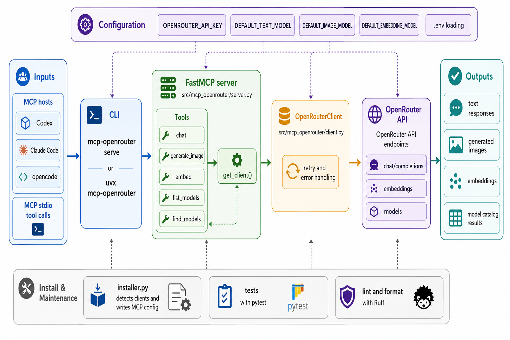

<div align="center">
  

  **🚀 One MCP server for OpenRouter models 🚀**
</div>

<!-- mcp-name: io.github.tsilva/mcp-openrouter -->

`mcp-openrouter` is a Python MCP server that lets Codex, Claude Code, opencode, and other MCP hosts call OpenRouter models from local stdio tools.

It exposes chat, image generation, embeddings, model listing, and model search through a small FastMCP server with `.env` support, retry handling, host-aware installation, and optional default model environment variables.

## Install

Install the published server into every detected MCP client:

```bash
uvx mcp-openrouter install --yes
```

Install into selected clients:

```bash
uvx mcp-openrouter install --yes --clients codex,claude,opencode
```

Pass the OpenRouter key directly for non-interactive setup:

```bash
uvx mcp-openrouter install --yes --api-key sk-or-v1-...
```

Run from a local checkout:

```bash
git clone https://github.com/tsilva/mcp-openrouter.git
cd mcp-openrouter
uv sync --dev
OPENROUTER_API_KEY=your-key uv run mcp-openrouter
```

`mcp-openrouter` with no arguments starts the stdio server. The explicit command is `uv run mcp-openrouter serve`.

## Commands

```bash
uvx mcp-openrouter install --yes                 # install into detected MCP clients
uvx mcp-openrouter install --yes --force         # replace an existing openrouter config
uvx mcp-openrouter uninstall --yes               # remove from detected MCP clients
uv run mcp-openrouter                            # run the local stdio server
uv run pytest tests/test_cli.py tests/test_client.py tests/test_config.py tests/test_installer.py tests/test_release_metadata.py tests/test_server.py
OPENROUTER_API_KEY=your-key uv run pytest tests/test_tools.py
uv run ruff check src/
uv run ruff format src/
```

## Tools

| Tool | Purpose |
| --- | --- |
| `chat` | Send a prompt or message list to an OpenRouter chat model. |
| `generate_image` | Generate one image and optionally save it to an absolute local path. |
| `embed` | Generate embeddings for a string or list of strings. |
| `list_models` | List models, optionally filtered by `vision`, `image_gen`, `embedding`, `tools`, or `long_context`. |
| `find_models` | Search model names and slugs, returning up to 20 matches. |

Example MCP prompts:

```text
Use openrouter chat with anthropic/claude-sonnet-4 to summarize this file
Use openrouter generate_image with google/gemini-3-pro-image-preview to create a square app icon
Use openrouter embed with mistralai/mistral-embed-2312 to embed "Hello world"
Use openrouter list_models with capability "image_gen"
Use openrouter find_models to search for "claude"
```

## Configuration

`OPENROUTER_API_KEY` is required for all tool calls. Set it in your shell, pass it during installation, or put it in `.env`.

Optional defaults make the `model` parameter optional for matching tools:

```bash
OPENROUTER_API_KEY=sk-or-v1-your-key-here
DEFAULT_TEXT_MODEL=google/gemini-3-pro-image-preview
DEFAULT_IMAGE_MODEL=google/gemini-3-pro-image-preview
DEFAULT_CODE_MODEL=anthropic/claude-sonnet-4.5
DEFAULT_VISION_MODEL=google/gemini-3-pro-image-preview
DEFAULT_EMBEDDING_MODEL=mistralai/mistral-embed-2312
```

The current tools read `DEFAULT_TEXT_MODEL`, `DEFAULT_IMAGE_MODEL`, and `DEFAULT_EMBEDDING_MODEL`. `DEFAULT_CODE_MODEL` and `DEFAULT_VISION_MODEL` are available for client conventions. The server loads `.env` from the current working directory and from the repository root when running from a checkout.

## Notes

- Python 3.10+ is required.
- The published runtime command installed into hosts is `uvx mcp-openrouter`.
- Supported installer targets are Codex, Claude Code, and opencode.
- `generate_image.output_path` must be absolute, for example `/Users/you/output.png`.
- Unit tests mock network calls. `tests/test_tools.py` requires a live `OPENROUTER_API_KEY`.
- After changing server code, restart the MCP host so it launches a fresh server process.
- Keep `server.json`, `CHANGELOG.md`, and the package version in sync before release. The Makefile release helper is `make release-x.y.z`.

## Local MCP Development

Register a local checkout when you want an MCP host to run your working tree instead of the published PyPI package.

Claude Code:

```bash
claude mcp add openrouter --scope user -- uv run --directory /path/to/mcp-openrouter mcp-openrouter
```

Codex:

```bash
codex mcp add openrouter --env OPENROUTER_API_KEY=your-key -- uv run --directory /path/to/mcp-openrouter mcp-openrouter
```

opencode:

```json
{
  "mcp": {
    "openrouter": {
      "type": "local",
      "command": ["uv", "run", "--directory", "/path/to/mcp-openrouter", "mcp-openrouter"],
      "environment": {
        "OPENROUTER_API_KEY": "your-key"
      },
      "enabled": true
    }
  }
}
```

## Architecture



## License

[MIT](LICENSE)
